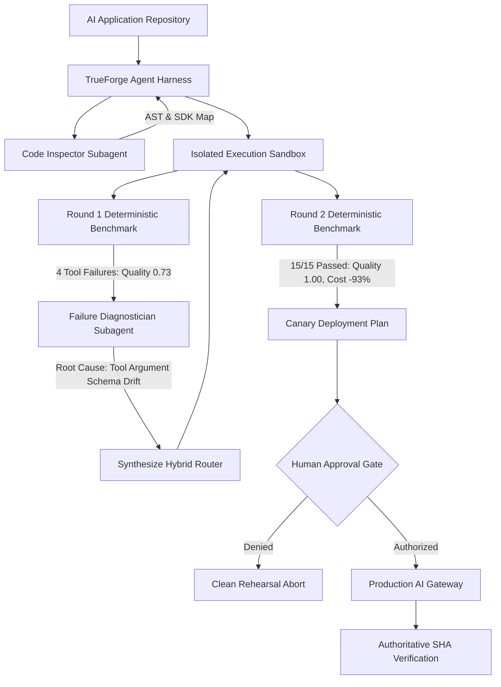

# ModelForge

[](https://github.com/truefoundry/trueforge)
[](https://www.typescriptlang.org/)
[](https://modelcontextprotocol.io/)

> **Autonomous AI Model Migration Rehearsal Agent built on TrueForge.**  
> ModelForge safely migrates an AI application from one foundation model to another by inspecting the actual codebase, testing the change in an isolated sandbox against deterministic workloads, catching regressions, autonomously diagnosing failures and engineering hybrid remediations, and strictly halting at a human approval boundary before any production routing mutation.

---

## 1. Technical Map



---

## 2. Core Architectural Invariants

1. **Separation of LLM Reasoning and Ground Truth**:
   The LLM **never** decides whether its own migration succeeded. An independent Deterministic Evaluation Substrate runs 15 fixed test cases with strict `zod` parameter schema validation, high-resolution latency timers, and exact token math.
2. **The "Prepare-Before-Apply" Privilege Boundary**:
   Code inspection, sandbox execution, and benchmark evaluations execute in an unprivileged sandbox with **zero write credentials**. The production gateway token is only granted to `apply_production_routing` after human approval.
3. **TrueForge Native Tool Approval Gates**:
   `apply_production_routing` is enforced via TrueForge's native `require_approval_for_tools`. The harness physically pauses the turn until the human operator signs off.
4. **Bare JSON Output Protocol & Typed Contracts**:
   Subagents (`code-inspector`, `failure-diagnostician`) emit strict single-line JSON adhering to Version 1.0 contracts. Malformed prose is rejected.

---

## 3. The Controlled Failure & Autonomous Recovery

Unlike trivial migration scripts that change a model name and blindly declare success, ModelForge encounters and solves a **realistic capability regression**:

* **Baseline (Model A)**: `openai/gpt-4o` (High quality, high accuracy, expensive: $1.85 / 1k requests).
* **Proposed Candidate (Model B)**: `openai/gpt-4o-mini` (Fast: 19ms p95, cheap: $0.02 / 1k requests, **but fails nested tool schemas**).

### Round 1: Naive Migration
* Conversational QA: 4/4 passed.
* Summarization: 4/4 passed.
* Structured Extraction: 3/3 passed.
* **Tool Calling: 0/4 passed** (Invalid JSON schema: string order IDs instead of numbers, invalid enum values).
* **Evaluator Verdict: FAIL (Quality: 0.73)**.

### Autonomous Diagnosis & Staged Remediation
The `failure-diagnostician` subagent determines that Model B has a localized parameter generation deficiency on tools, but excels on conversational and summarization tasks. It synthesizes a **Hybrid Task Routing Architecture**:
* Tools $\rightarrow$ Model A
* QA, Summaries, Extraction $\rightarrow$ Model B

### Round 2: Validation
* **15/15 Passed (Quality: 1.00, Latency: 65ms, Cost: -93%)**.
* **Evaluator Verdict: PASS**.

---

## 4. TrueForge Harness Surfaces

| TrueForge Capability | Concrete Usage in ModelForge |
|---|---|
| **Local Standalone Server** | Runs via `npx @truefoundry/trueforge` on port `8790` with embedded SQLite. |
| **Streamable HTTP MCP** | Connects `rehearsal-mcp` (:8951) and `gateway-mcp` (:8952) over standard MCP protocol. |
| **Tool Approval Gates** | `apply_production_routing` is intercepted by TrueForge, emitting `tool.approval_required`. |
| **Persistent Sessions** | Sessions survive network reconnects, storing turn events and approvals in SQLite. |
| **Dynamic Subagents** | Spawns `code-inspector` and `failure-diagnostician` with isolated context windows. |
| **Native Sandbox Execution** | Spawns and manages the target application on ephemeral ports during evaluation. |
| **SSE Event Replay** | Powers the Command Center UI and CLI runner via `after_sequence_number`. |

---

## 5. Quickstart

### Prerequisites
* Node.js $\ge 22.0.0$
* pnpm $\ge 11.0.0$

### 1. Install Dependencies
```bash
pnpm install
```

### 2. Run Automated Verification Tests
```bash
pnpm test
```
All 8 unit and integration tests validate specialist contracts, deterministic assertions, and MCP boundaries.

### 3. Run the End-to-End Migration Rehearsal Demo
```bash
# Run with interactive human approval prompt:
pnpm demo

# Or run in headless auto-approve mode:
pnpm demo --auto-approve
```

### 4. Run the TrueForge Harness & Bootstrap Agent
```bash
# Terminal 1: Start TrueForge Agent Server
pnpm trueforge:start

# Terminal 2: Register MCP connectors and agent
pnpm modelforge:bootstrap

# Terminal 3: Run interactive TrueForge session
pnpm modelforge:run
```

### 5. Launch the Rehearsal Command Center (Web UI)
```bash
cd apps/command-center
pnpm dev
# Open http://localhost:3000 in your browser
```

---

## 6. AI Assistance Disclosure

In compliance with hackathon rules, this project was architected, written, and verified using **Antigravity (AG)** as the primary AI coding and development environment.
