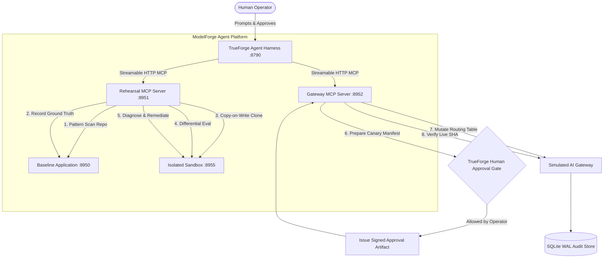

# ModelForge - Migration Rehearsal Agent

[](./LICENSE)
[](https://github.com/truefoundry/trueforge)
[](https://www.typescriptlang.org/)
[](https://modelcontextprotocol.io/)

> **Autonomous AI Model Migration Rehearsal Agent built on TrueForge.**  
> ModelForge safely migrates an AI application from one foundation model to another by inspecting the actual codebase, testing candidate changes in an isolated sandbox against deterministic workloads, catching regressions, autonomously diagnosing failures, engineering hybrid remediations, and strictly halting at a human approval boundary before any production routing mutation.

**[Solution Writeup](./SOLUTION.md)** - Problem statement, architecture, TrueForge usage, real vs. mocked, and known limits.  
**[3-Minute Demo Script & Video Runbook](./DEMO_SCRIPT.md)** - Step-by-step terminal setup, UI prompt, and video narration guide.

---

## 1. System Architecture



---

## 2. Core Architectural Invariants

1. **Strict Separation of LLM Reasoning and Empirical Ground Truth**:
   The LLM **never** decides whether its own migration succeeded. An independent Deterministic Evaluation Engine runs fixed test cases with strict `zod` parameter schema validation, high-resolution latency timers, and cost calculations.
2. **Copy-on-Write Sandbox Isolation**:
   All code changes happen in an isolated temporary sandbox (`.modelforge-sandboxes/`). The source repository is never mutated during rehearsal.
3. **TrueForge Native Tool Approval Gates**:
   `apply_production_routing` is enforced via TrueForge's native policy engine (`require_approval_for_tools`). Execution physically halts until an operator clicks **`[Allow]`** on the dashboard or issues a signed token.
4. **Independently Verifiable Approval Artifacts**:
   Production routing mutations require an HMAC-SHA256 signature bound to the `session_id`, `canary_id`, and immutable `manifest_sha`. Unsigned or tampered requests are rejected by the gateway.
5. **Durable Crash-Resilient Lifecycle**:
   State transitions and evaluation reports are persisted atomically to a `node:sqlite` WAL store. If processes restart mid-rehearsal, sessions rehydrate without losing history.

---

## 3. Quickstart (From Scratch)

### Prerequisites
* **Node.js** >= 22.0.0 (for native `node:sqlite`)
* **pnpm** >= 11.0.0

### Setup

```bash
git clone <repo-url> && cd modelforge
cp .env.example .env          # Edit .env with your API key
pnpm install
```

See [`.env.example`](./.env.example) for all configurable provider keys (Groq, NVIDIA, OpenAI, Mistral).

### Run

```bash
# Terminal 1 - TrueForge Agent Harness
nvm use 22 && pnpm trueforge:start

# Terminal 2 - ModelForge Microservices (baseline app + MCP servers)
nvm use 22 && pnpm start:baseline & pnpm start:rehearsal-mcp & pnpm start:gateway-mcp

# Terminal 3 - Bootstrap agent with TrueForge
nvm use 22 && pnpm modelforge:bootstrap
```

Verify all services are healthy:
```bash
curl -s http://127.0.0.1:8950/health   # Baseline App
curl -s http://127.0.0.1:8951/health   # Rehearsal MCP
curl -s http://127.0.0.1:8952/health   # Gateway MCP
```

### Run the Migration Rehearsal

#### Option A: TrueForge Web UI (Recommended)
1. Open `http://localhost:8790` in your browser.
2. Click **New Chat** -> select agent **`modelforge-migration-commander`**.
3. Send prompt:
   ```text
   Please execute a migration rehearsal for "demo-apps/customer-support-app".
   You must call each tool strictly one at a time sequentially:
   1. Inspect the repository AI usage using repo_path "demo-apps/customer-support-app".
   2. Establish baseline evidence against "http://127.0.0.1:8950".
   3. Generate a migration plan for candidate target model "model-b".
   4. Stage candidate model "model-b" using repo_path "demo-apps/customer-support-app".
   5. Run the candidate application in the sandbox using sandbox_run_app.
   6. Run the deterministic benchmark using run_deterministic_benchmark.
   7. Call compare_rehearsals to compare candidate vs baseline.
   8. If regressions detected, call diagnose_failures and apply_sandbox_remediation, then re-test.
   9. When comparison passes, call prepare_canary_manifest with evaluation proof.
   10. Call apply_production_routing with canary_id.
   11. After approval, verify with verify_gateway_routing.
   ```
4. Watch the agent execute each discrete MCP tool live on screen.
5. When the agent reaches `apply_production_routing`, TrueForge will display the **`[Allow]` / `[Deny]`** approval gate.
6. Click **`[Allow]`** to authorize production mutation and verify live gateway routing!

#### Option B: Terminal CLI Run
```bash
# Interactive mode (prompts terminal for approval):
pnpm modelforge:run

# Headless mode (auto-approves at approval gate):
pnpm modelforge:run --auto-approve
```

---

## 4. Live TrueForge Execution Evidence & Generative UI

ModelForge includes authentic, reproducible live execution evidence recorded from real TrueForge SSE sessions (`npx @truefoundry/trueforge` at `:8790`):

* **[Live Generative UI Operator Dashboard](./evidence/trueforge-live/operator_dashboard_evidence.md)** - Complete 6-panel live rehearsal dashboard (Timeline, Evaluation Differential Matrix, Root Cause Diagnosis, Sandbox Isolation, Canary Approval Gate, and Live Gateway SHA Verification).
* **[Ordered Tool Call Transcript](./evidence/trueforge-live/session_transcript.json)** - 13 discrete sequential MCP calls with full JSON inputs and outputs.
* **[Authoritative Audit Receipt](./evidence/trueforge-live/audit_receipt.json)** - Cryptographically signed final audit receipt (`receipt_sha: 91043e69...`).
* **[Service Health Checks](./evidence/trueforge-live/health_checks.json)** - Snapshot of TrueForge, Rehearsal MCP, Gateway MCP, and Baseline App.

---

## 5. Discrete MCP Tool Reference

ModelForge exposes **15 discrete MCP tools** split across two namespaced MCP servers:

### Rehearsal MCP Server (`http://127.0.0.1:8951/mcp`)

| Tool Name | Input Schema | Description |
|---|---|---|
| `repo_inspect_ai_usage` | `repo_path` | Static pattern scan of repository mapping SDKs, model references, and tool schemas. |
| `establish_baseline` | `endpoint_url` | Runs 15-case benchmark against unmodified baseline app to establish empirical ground truth. |
| `generate_migration_plan` | `source_model`, `target_model` | Synthesizes migration plan with risk rating, code diffs, and acceptance criteria. |
| `stage_code_migration` | `repo_path`, `active_model` | Clones app into an isolated sandbox (`.modelforge-sandboxes/`) and applies model patch. |
| `sandbox_run_app` | `port` | Launches candidate app process inside the sandbox on an ephemeral port. |
| `run_deterministic_benchmark` | `endpoint_url`, `candidate_id` | Executes 15-case evaluation against candidate app measuring accuracy, latency, and costs. |
| `compare_rehearsals` | `session_id` | Differential matrix comparison calculating accuracy shift, cost savings, and regressions. |
| `diagnose_failures` | `session_id` | Failure taxonomy diagnosis returning root cause classification and recommended strategy. |
| `apply_sandbox_remediation` | `strategy` | Applies sandbox remediation patch (e.g. `hybrid_routing`) to sandbox files. |
| `abort_migration` | `reason` | Explicitly halts and aborts migration when candidate is incompatible or unsupported. |
| `get_session_state` | `session_id` | Queries current durable state machine state from SQLite. |

### Gateway MCP Server (`http://127.0.0.1:8952/mcp`)

| Tool Name | Input Schema | Description |
|---|---|---|
| `prepare_canary_manifest` | `candidate_id`, `evaluation_proof` | Builds 90/10 canary plan with circuit breakers and computes immutable `manifest_sha`. |
| `apply_production_routing` | `canary_id`, `approval_token` | **APPROVAL REQUIRED**: Mutates live gateway routing table after cryptographic token verification. |
| `verify_gateway_routing` | `expected_canary_id` | Confirms live gateway routing SHA matches approved canary manifest and commits audit receipt. |
| `emergency_rollback` | `reason` | Immediately reverts live gateway routing to 100% baseline model. |

---

## 6. Automated Test Suite

```bash
nvm use 22 && pnpm test    # 180 tests across 15 files (100% PASS)
nvm use 22 && pnpm typecheck  # Strict TypeScript check (0 errors)
```

Tests validate:
* Specialist contracts and JSON schemas
* State machine transitions, fail-closed approval boundaries, and illegal sequence rejection
* Sandbox filesystem copy-on-write isolation (zero writes to origin)
* Deterministic benchmark evaluations and failure taxonomy classification
* Cryptographic approval artifact verification and signature tampering protection

---

## 7. Scope & Known Boundaries

> **Honest Scope Notice**: ModelForge currently supports locally runnable AI apps with HTTP evaluation endpoints. The demo proves the end-to-end migration rehearsal loop. Arbitrary repository support is future work.

See [**SOLUTION.md**](./SOLUTION.md) for full architectural disclosure on what is real vs. simulated.

---

## License

[MIT](./LICENSE)

