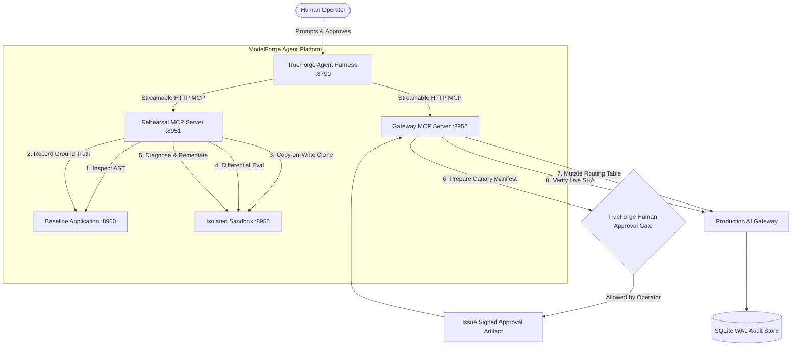

# ModelForge

[](https://github.com/truefoundry/trueforge)
[](https://www.typescriptlang.org/)
[](https://modelcontextprotocol.io/)

> **Autonomous AI Model Migration Rehearsal Agent built on TrueForge.**  
> ModelForge safely migrates an AI application from one foundation model to another by inspecting the actual codebase, testing candidate changes in an isolated sandbox against deterministic workloads, catching regressions, autonomously diagnosing failures, engineering hybrid remediations, and strictly halting at a human approval boundary before any production routing mutation.

---

## 1. System Architecture



---

## 2. Core Architectural Invariants

1. **Strict Separation of LLM Reasoning and Empirical Ground Truth**:
   The LLM **never** decides whether its own migration succeeded. An independent Deterministic Evaluation Engine runs fixed test cases with strict `zod` parameter schema validation, high-resolution latency timers, and cost calculations.
2. **Copy-on-Write Sandbox Isolation**:
   All code changes happen in an isolated temporary sandbox (`.modelforge-sandboxes/`). The source repository is never mutated during rehearsal.
3. **TrueForge Native Tool Approval Gates**:
   `apply_production_routing` is enforced via TrueForge's native policy engine (`require_approval_for_tools`). Execution physically halts until an operator clicks **`[Allow]`** on the dashboard or issues a signed token.
4. **Independently Verifiable Approval Artifacts**:
   Production routing mutations require an HMAC-SHA256 signature bound to the `session_id`, `canary_id`, and immutable `manifest_sha`. Unsigned or tampered requests are rejected by the gateway.
5. **Durable Crash-Resilient Lifecycle**:
   State transitions and evaluation reports are persisted atomically to a `node:sqlite` WAL store. If processes restart mid-rehearsal, sessions rehydrate without losing history.

---

## 3. Complete Step-by-Step Quickstart (From Scratch)

### Prerequisites
* **Node.js**: $\ge 22.0.0$ (for native `node:sqlite`)
* **pnpm**: $\ge 11.0.0$

---

### Step 1: Environment Setup & Dependencies

Clone the repository and install all dependencies:
```bash
cd modelforge
pnpm install
```

Create `.env` file in the `modelforge` directory:
```bash
cat << 'EOF' > .env
TRUEFORGE_BASE_URL=http://127.0.0.1:8790
PORT=8955

# Provider API Keys (Set at least one)
GROQ_API_KEY=gsk_...
NVIDIA_API_KEY=nvapi-...
OPENAI_API_KEY=sk-...

MODELFORGE_PROVIDER=auto
TRUEFORGE_MODEL=nvidia/llama-3-2-11b
EOF
```

---

### Step 2: Start TrueForge Agent Server

Start TrueForge with network policy disabled for local loopback communication:
```bash
# Terminal 1: TrueForge Agent Harness
pnpm trueforge:start

# Or directly using npx:
# NETWORK_POLICY_ENABLED=false npx -y @truefoundry/trueforge --port 8790
```
*TrueForge UI is now reachable at `http://localhost:8790`.*

---

### Step 3: Register Model Provider in TrueForge

Register your API provider key in TrueForge. You can do this via the Web UI (`http://localhost:8790/settings`) or via HTTP API:

```bash
# Register NVIDIA provider (or Groq / OpenAI)
curl -s -X PUT http://127.0.0.1:8790/api/v1/settings/model-providers \
  -H "Content-Type: application/json" \
  -d '{
    "manifest": {
      "type": "custom",
      "name": "nvidia",
      "base_url": "https://integrate.api.nvidia.com/v1",
      "auth": { "api_key": "YOUR_NVIDIA_API_KEY" },
      "models": [
        {
          "name": "llama-3-2-11b",
          "model_id": "meta/llama-3.2-11b-vision-instruct",
          "properties": { "context_length": 128000, "max_output_tokens": 4096 }
        }
      ]
    }
  }'
```

---

### Step 4: Start ModelForge Microservices & Daemons

In separate terminal windows (or background jobs), start the baseline app and the two MCP servers:

```bash
# Terminal 2: Baseline Customer Support Application
PORT=8950 pnpm start:baseline

# Terminal 3: Rehearsal MCP Server
PORT=8951 pnpm start:rehearsal-mcp

# Terminal 4: Gateway MCP Server
PORT=8952 pnpm start:gateway-mcp
```

Verify all services are healthy:
```bash
curl -s http://127.0.0.1:8950/health
curl -s http://127.0.0.1:8951/health
curl -s http://127.0.0.1:8952/health
```

---

### Step 5: Bootstrap the ModelForge Agent

Register the agent definition and MCP server connectors with TrueForge:
```bash
# Terminal 5: Bootstrap Agent
pnpm modelforge:bootstrap
```

Output:
```text
[bootstrap] Connecting to TrueForge at http://127.0.0.1:8790...
[bootstrap] TrueForge is running! API Version: 0.2.1
[bootstrap] Registering MCP connector: rehearsal-mcp -> http://127.0.0.1:8951/mcp
[bootstrap] Registering MCP connector: gateway-mcp -> http://127.0.0.1:8952/mcp
[bootstrap] Registering agent: modelforge-migration-commander
[bootstrap] Agent registered successfully! ID: 01m3ebdry41nstcgm229gp8qff
[bootstrap] ModelForge is fully bootstrapped and ready.
```

---

### Step 6: Run the Live Migration Rehearsal

#### Option A: Interactive Run via TrueForge Web UI (Recommended)
1. Open `http://localhost:8790` in your browser.
2. Click **New Chat** $\rightarrow$ select agent **`modelforge-migration-commander`**.
3. Send prompt:
   ```text
   Please execute a migration rehearsal for "demo-apps/customer-support-app".
   ```
4. Watch the agent execute each discrete MCP tool live on screen.
5. When the agent reaches `apply_production_routing`, TrueForge will display the **`[Allow]` / `[Deny]`** approval gate.
6. Click **`[Allow]`** to authorize production mutation and verify live gateway routing!

#### Option B: Terminal CLI Run
```bash
# Interactive mode (prompts terminal for approval):
pnpm modelforge:run

# Headless mode (auto-approves at approval gate):
pnpm modelforge:run --auto-approve
```

---

## 4. Discrete MCP Tool Reference

ModelForge exposes 11 discrete MCP tools split across two namespaced MCP servers:

### Rehearsal MCP Server (`http://127.0.0.1:8951/mcp`)

| Tool Name | Input Schema | Description |
|---|---|---|
| `repo_inspect_ai_usage` | `repo_path` | AST scan of target repository mapping frameworks, coupling sites, and tool schemas. |
| `establish_baseline` | `endpoint_url` | Runs 15-case benchmark against unmodified baseline app to establish empirical ground truth. |
| `generate_migration_plan` | `source_model`, `target_model` | Synthesizes migration plan with risk rating, code diffs, and acceptance criteria. |
| `stage_code_migration` | `repo_path`, `active_model` | Clones app into an isolated sandbox (`.modelforge-sandboxes/`) and applies model patch. |
| `sandbox_run_app` | `port` | Launches candidate app process inside the sandbox on an ephemeral port. |
| `run_deterministic_benchmark` | `endpoint_url`, `candidate_id` | Executes 15-case evaluation against candidate app measuring accuracy, latency, and costs. |
| `compare_rehearsals` | `session_id` | Differential matrix comparison calculating accuracy shift, cost savings, and regressions. |
| `diagnose_failures` | `session_id` | Failure taxonomy diagnosis returning root cause classification and recommended strategy. |
| `apply_sandbox_remediation` | `strategy` | Applies sandbox remediation patch (e.g. `hybrid_routing`) to sandbox files. |
| `get_session_state` | `session_id` | Queries current durable state machine state from SQLite. |

### Gateway MCP Server (`http://127.0.0.1:8952/mcp`)

| Tool Name | Input Schema | Description |
|---|---|---|
| `prepare_canary_manifest` | `candidate_id`, `evaluation_proof` | Builds 90/10 canary plan with circuit breakers and computes immutable `manifest_sha`. |
| `apply_production_routing` | `canary_id`, `approval_token` | **APPROVAL REQUIRED**: Mutates live gateway routing table after cryptographic token verification. |
| `verify_gateway_routing` | `expected_canary_id` | Confirms live gateway routing SHA matches approved canary manifest and commits audit receipt. |
| `emergency_rollback` | `reason` | Immediately reverts live gateway routing to 100% baseline model. |

---

## 5. Automated Test Suite

Run unit and contract verification tests:
```bash
pnpm test
```

Tests validate:
* Specialist contracts and JSON schemas
* State machine transitions and illegal sequence rejection
* Sandbox filesystem copy-on-write isolation
* Deterministic benchmark evaluations and failure taxonomy classification
* Cryptographic approval artifact verification and signature tampering protection
